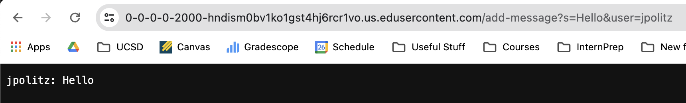

# Lab Report 2

# Part 1 - `ChatServer.java`

```
import java.io.IOException;
import java.net.URI;

class Handler implements URLHandler {
    
    public String chatMessages = "";

    public String handleRequest(URI url) {
        if (url.getPath().equals("/add-message")) {
            String query = url.getQuery();
            String[] parameters = query.split("&");
            String user = "";
            String message = "";

            for (String param : parameters) {
                String[] val = param.split("=");
                if (val.length == 2) {
                    if (val[0].equals("user")) {
                        user = val[1];
                    } else if (val[0].equals("s")) {
                        message = val[1];
                    }
                }
            }

            if (user != null && message != null) {
                chatMessages += user + ": " + message + "\n";
                return chatMessages;
            } else {
                return "Invalid parameters for adding a message!";
            }
        } else if (url.getPath().equals("/")) {
            return "Welcome to the chat room! Here are the current messages: \n\n" + chatMessages;
        } else {
            return "404 Not Found!";
        }
    }
}

class ChatServer {
    public static void main(String[] args) throws IOException {
        if(args.length == 0){
            System.out.println("Missing port number! Try any number between 1024 to 49151");
            return;
        }

        int port = Integer.parseInt(args[0]);

        Server.start(port, new Handler());
    }
}
```  
  
  
  
- The method called in my code in this image is the `handleRequest()` method.
- The relevant argument to this method would be the `URI url` which is what allows the code the process the contents of the url query which contains all of the information used in this code to display the intended content for the ChatServer. The query is what contains the values used to create the chat room.
- The values `String query`, `String[] paremeters`, `String user`, `String message`, and `String chatMessages` get changed from this request. In this specifc instance, the values change accordingly:
      - `String query`: The value for this changes to `"s=Hello&user=jpolitz"`.
      - `String[] paremeters`: The value for this changes to a list which is split at `&` to allow us to determine the value of the arguments in the query. The is variable changes to `["s=Hello", "user=jpolitz"]`.
      - `String user`: The value for this changes to the `user` value from the argument in the query. This variable changes to `"jpolitz"`.
      - `String message`: The value for this changes to the `message` value from the argument in the query. This variable changes to `"Hello"`.
      - `String chatMessages`: This value gets displayed on the main page. This variable changes to `"jpolitz: Hello\n"`. 
  
  
  
- The method called in my code in this image is the `handleRequest()` method.
- The relevant argument to this method would be the `URI url` which is what allows the code the process the contents of the url query which contains all of the information used in this code to display the intended content for the ChatServer. The query is what contains the values used to create the chat room. 
- The values `String query`, `String[] paremeters`, `String user`, `String message`, and `String chatMessages` get changed from this request. In this specifc instance, the values change accordingly:
      - `String query`: The value for this changes to `"s=How are you&user=yash"`.
      - `String[] paremeters`: The value for this changes to a list which is split at `&` to allow us to determine the value of the arguments in the query. The is variable changes to `["s=How are you", "user=yash"]`.
      - `String user`: The value for this changes to the `user` value from the argument in the query. This variable changes to `"yash"`.
      - `String message`: The value for this changes to the `message` value from the argument in the query. This variable changes to `"How are you"`.
      - `String chatMessages`: This value gets displayed on the main page. This variable changes to `"jpolitz: Hello\n"yash: How are you`. 
  
# Part 2


  
# Part 3
  

