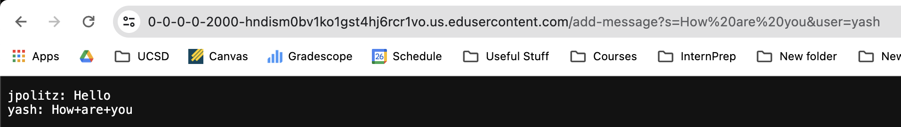

# Lab Report 2

# Part 1 - `ChatServer.java`

```
import java.io.IOException;
import java.net.URI;

class Handler implements URLHandler {
    
    public String chatMessages = "";

    public String handleRequest(URI url) {
        if (url.getPath().equals("/add-message")) {
            String query = url.getQuery();
            String[] parameters = query.split("&");
            String user = "";
            String message = "";

            for (String param : parameters) {
                String[] keyValue = param.split("=");
                if (keyValue.length == 2) {
                    if (keyValue[0].equals("user")) {
                        user = keyValue[1];
                    } else if (keyValue[0].equals("s")) {
                        message = keyValue[1];
                    }
                }
            }

            if (!user.isEmpty() && !message.isEmpty()) {
                chatMessages += user + ": " + message + "\n";
                return chatMessages;
            } else {
                return "Invalid parameters for adding a message!";
            }
        } else if (url.getPath().equals("/")) {
            return "Welcome to the chat room! Here are the current messages: \n\n" + chatMessages;
        } else {
            return "404 Not Found!";
        }
    }
}

class ChatServer {
    public static void main(String[] args) throws IOException {
        if(args.length == 0){
            System.out.println("Missing port number! Try any number between 1024 to 49151");
            return;
        }

        int port = Integer.parseInt(args[0]);

        Server.start(port, new Handler());
    }
}
```  
  
  
  
  
  
  
  
  
  
# Part 2


  
# Part 3
  

