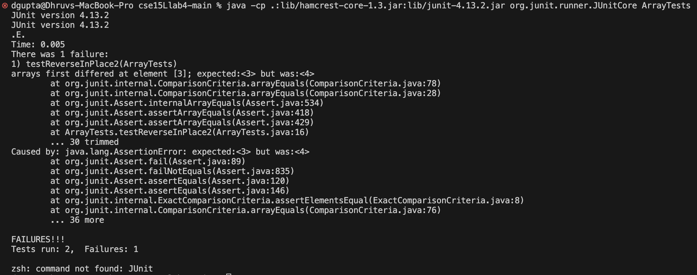

# Lab Report 3

## Part 1 - Bugs 
### A failure-inducing input for the buggy program

Input: `{1, 2, 3, 4, 5, 6}`

JUnit Test Code for `testReverseInPlace2`: 
```
@Test 
public void testReverseInPlace2() {
  int[] input1 = { 1, 2, 3, 4, 5, 6 };
  ArrayExamples.reverseInPlace(input1);
  assertArrayEquals(new int[]{ 6, 5, 4, 3, 2, 1 }, input1);
}
```
Buggy Method Implementation: 
```
static void reverseInPlace(int[] arr) {
  for(int i = 0; i < arr.length; i += 1) {
    arr[i] = arr[arr.length - i - 1];
  }
}
```

JUnit Output: 
```
JUnit version 4.13.2
.E..
Time: 0.005
There was 1 failure:
1) testReverseInPlace2(ArrayTests)
arrays first differed at element [3]; expected:<3> but was:<4>
        at org.junit.internal.ComparisonCriteria.arrayEquals(ComparisonCriteria.java:78)
        at org.junit.internal.ComparisonCriteria.arrayEquals(ComparisonCriteria.java:28)
        at org.junit.Assert.internalArrayEquals(Assert.java:534)
        at org.junit.Assert.assertArrayEquals(Assert.java:418)
        at org.junit.Assert.assertArrayEquals(Assert.java:429)
        at ArrayTests.testReverseInPlace2(ArrayTests.java:16)
        ... 30 trimmed
Caused by: java.lang.AssertionError: expected:<3> but was:<4>
        at org.junit.Assert.fail(Assert.java:89)
        at org.junit.Assert.failNotEquals(Assert.java:835)
        at org.junit.Assert.assertEquals(Assert.java:120)
        at org.junit.Assert.assertEquals(Assert.java:146)
        at org.junit.internal.ExactComparisonCriteria.assertElementsEqual(ExactComparisonCriteria.java:8)
        at org.junit.internal.ComparisonCriteria.arrayEquals(ComparisonCriteria.java:76)
        ... 36 more

FAILURES!!!
Tests run: 1,  Failures: 1
```

### An input that doesn't induce a failure

Input: `{ 3 }`

JUnit Test Code for `testReverseInPlace`:
```
@Test 
public void testReverseInPlace() {
  int[] input1 = { 3 };
  ArrayExamples.reverseInPlace(input1);
  assertArrayEquals(new int[]{ 3 }, input1);
}
```

JUnit Output: 
```
JUnit version 4.13.2
..
Time: 0.004

OK (1 test)
```

### The symptom, as the output of running the tests 

JUnit Test Code for `testReverseInPlace` and `testReverseInPlace2`:
```
public class ArrayTests {
  @Test 
  public void testReverseInPlace() {
    int[] input1 = { 3 };
    ArrayExamples.reverseInPlace(input1);
    assertArrayEquals(new int[]{ 3 }, input1);
  }

  @Test
  public void testReverseInPlace2() {
    int[] input1 = { 1, 2, 3, 4, 5, 6 };
    ArrayExamples.reverseInPlace(input1);
    assertArrayEquals(new int[]{ 6, 5, 4, 3, 2, 1 }, input1);
  }
}
```

JUnit Output: 


### The bug, as the before-and-after code change required to fix it 
Before code change required to fix it: 
```
static void reverseInPlace(int[] arr) {
  for(int i = 0; i < arr.length; i += 1) {
    arr[i] = arr[arr.length - i - 1];
  }
}
```

After code change required to fix it: 
```
static void reverseInPlace(int[] arr) {
  for(int i = 0; i < arr.length/2; i += 1) {
    int temp = arr[i];
    arr[i] = arr[arr.length - i - 1];
    arr[arr.length - i - 1] = temp;
  }
}
```

### Why the fix addresses the issue? 
In the former method implementation, the method would be successfully reverse the first half of the list. However, after the first half, it would create a palindrome within the array since it would be recieving its data from the updated list, which is updating chronilogically in the list after every iteration in the loop. Therefore, this issue needs to be fixed by updating the values in the beginning and end of the list at the same time. In order to do so, we can create a local variable that will store the value of the index which we are about to change and afterwords we will update the first and last element in the array and iterate till we get to the middle to successfully reverse the elements in the array. 

## Part 2 - Researching Commands 


## Works Cited 

