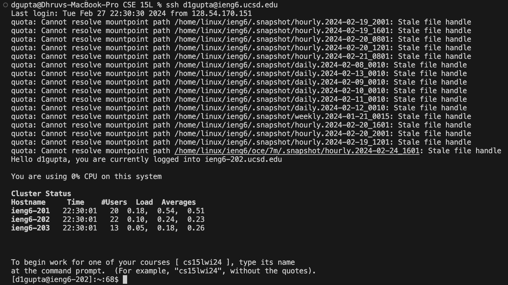
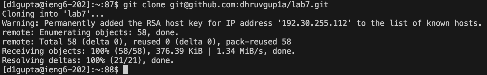
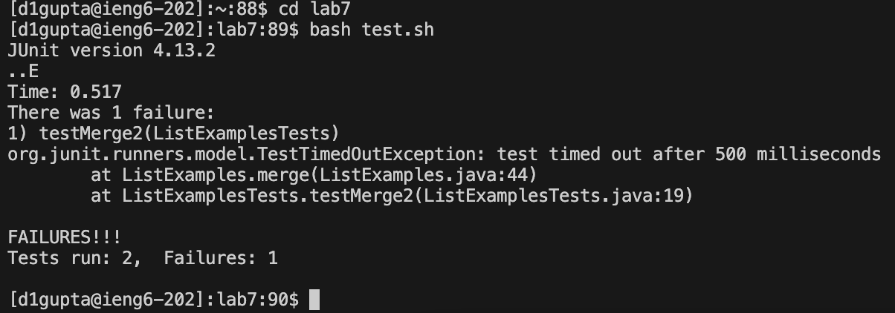
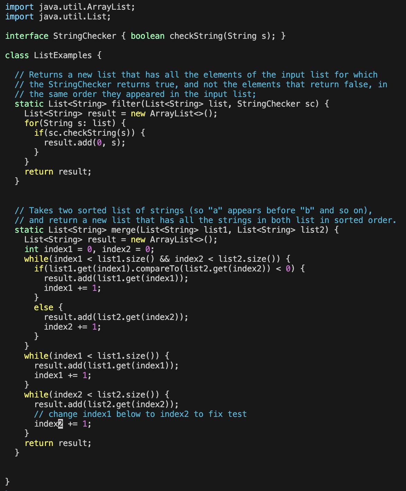
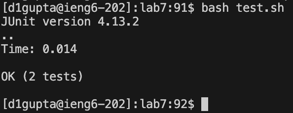
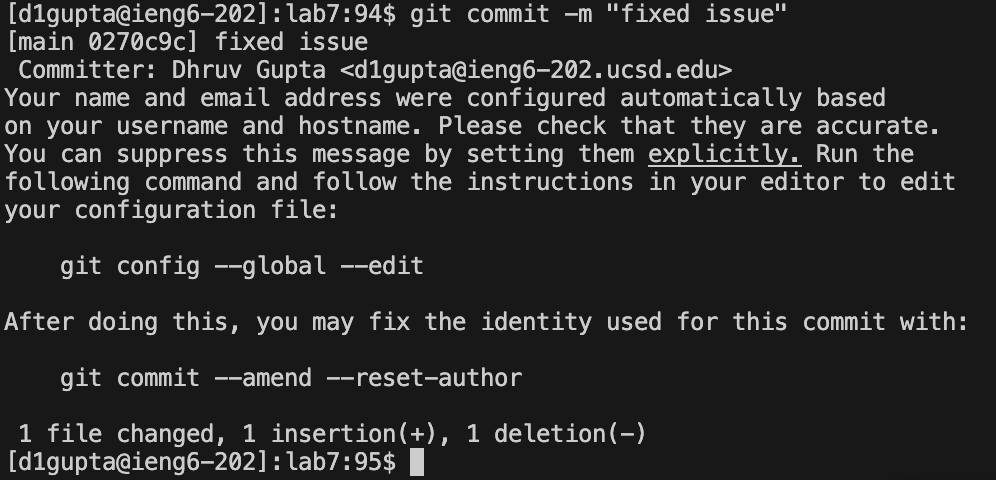

# Lab Report 3

### Step 4 - Log into ieng6

 

* Keys Pressed:
* 

### Step 5 - Clone your fork of the repository from your Github account (using the `SSH` URL)

 

* Keys Pressed:
* 

### Step 6 - Run the tests, demonstrating that they fail

 

* Keys Pressed:
* 

### Step 7 - Edit the code file to fix the failing test

 

* Keys Pressed:
* 

### Step 8 - Run the tests, demonstrating that they now succeed

 

* Keys Pressed:
* 

### Step 9 - Commit and push the resulting change to your Github account

 

* Keys Pressed:
* 

