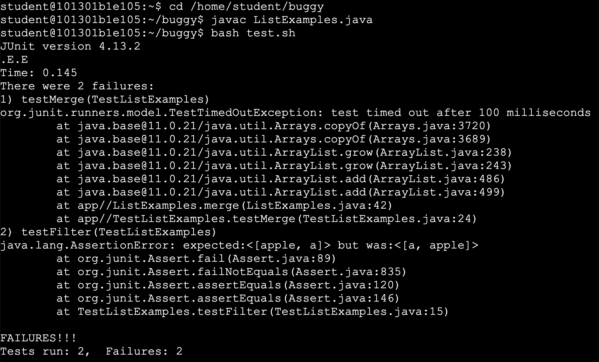

# Lab Report 5

## Part 1 - Debugging Scenario

### Original Post from a Student

Dear Teaching Staff,

I am currently trying to complete the practice skill demo 4 and I am confused with why the `ListExamples.java` file isn't passing all of the `test.sh` test cases. My best guess is that for the first test case, there is an operation that isn't completing because the JUnit test timed out. For the second test case, I am guessing that there is some logic error with how I add the values to the final list but I don't know how to fix it. Additionally, I am confused on how I can make changes to the file without having direct access to it. Can you please provide me with some direction on how to complete this step? 
 

### A Response from a TA

## Part 2 - Reflection

